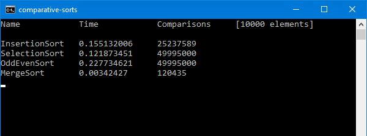

# Comparative Sorts

A comparison of simple sorting algorithms. This program measures the elapsed time of algorithm and the amount of times `compareTo` is called.

The following algorithms are being compared:

* Insertion sort
* Selection sort
* Odd/Even Transposition sort
* Merge sort

**Here is a sample output in console:**

> **Note:** To test it just compile it (`javac *.java`) and execute it (`java Program`).
